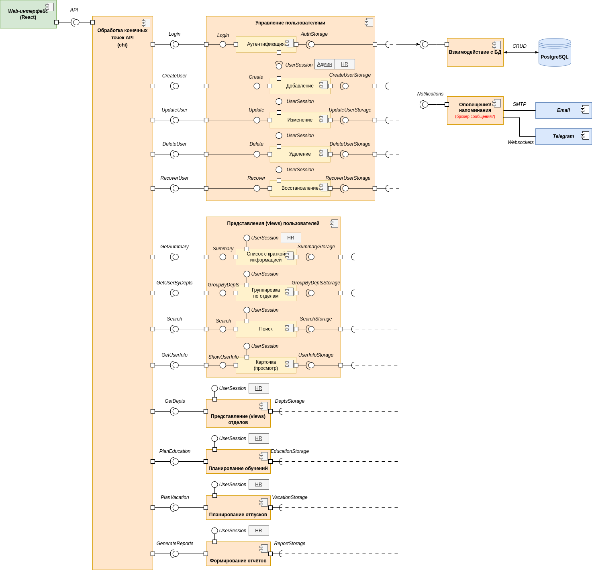

# Описание серверной части (backend) проекта "Картотека сотрудника"

- [Общая информация](#общая-информация)
- [Общий взгляд на продукт](#общий-взгляд-на-продукт)
- [Классы и характеристики пользователей](#классы-и-характеристики-пользователей)
- [Техническое задание](#техническое-задание)
  - [Пользовательские истории](docs/user_stories.adoc)
  - [Функциональные требования](docs/requirements.adoc)
  - [Диаграмма компонентов](#диаграмма-компонентов)
  - [Требования к данным](docs/data_requirements.adoc)
  - [Схема базы данных](#схема-базы-данных)
- [Особенности реализации](#особенности-реализации)
  - [Сборка](#сборка)
  - [Конфигурация](#конфигурация)
  - [Стек](#стек)
  - [Используемые библиотеки](#используемые-библиотеки)
- [Дальнейшее развитие](#дальнейшее-развитие)


## Общая информация

[Политика ветвления](docs/branching_policy.adoc)

[Внутри командное code review](docs/code_review.adoc)


## Общий взгляд на продукт

Картотека сотрудников — это новая система, создаваемая с целью помочь управлять персональными данными сотрудников: опыт работы, образование, хобби и другие. Она должна помочь повысить эффективность работы HR-отдела, структурировать и оптимизировать процессы управления и подбора персонала, сделать работу HR-отдела более эффективной и удобной.

Система включает в себя функции:
1.	Хранение и управление персональными данными сотрудников.
2.	Автоматизация рутинных задач управлением персонала (выявление неактуальных данных сотрудников, рассылка уведомлений сотрудникам, проверка вводимых данных на конфликт с существующими, напоминание о необходимости прохождения сотрудником инструктажа).
3.	Безопасность и конфиденциальность данных (аутентификация пользователей, разграничение прав на совершение просмотра/редактирования/добавления данных, шифрование данных в хранилище).
4.	Автоматизация процесса подбора (возможность доступа в систему для рекрутеров с целью добавления анкет возможных новых сотрудников, преобразование анкеты кандидата в карточку сотрудника) и управления/развития персонала (учёт данных по полученному и получаемому образованию сотрудников, предоставление льгот, учёт профессиональных компетенций).


## Классы и характеристики пользователей

| Класс пользователей | Описание                                                                                                                                                                                                                                                                                                       |
|---------------------|----------------------------------------------------------------------------------------------------------------------------------------------------------------------------------------------------------------------------------------------------------------------------------------------------------------|
| Кандидат            | Претендент на вакантную должность в компании.<br/>Не имеет прямого доступа в систему, взаимодействует через рекрутера. Заполняет резюме и отправляет его рекрутеру, при необходимости соглашается с обработкой персональных данных.                                                                            |
| Сотрудник           | Работник (бывший или настоящий) компании, персональные данные которого хранятся и обрабатываются в системе.                                                                                                                                                                                                    |
| HR                  | 1. Лицо, с которым у компании имеются договорные отношения с целью кадрового учета и управления персоналом<br/>2. Работник компании, занимающийся кадровым учетом и управлением персоналом<br/>Имеет права доступа на просмотр (минимально) и/или добавление и/или редактирование данных сотрудников компании. |
| Рекрутер            | 1. Лицо, с которым у компании имеются договорные отношения с целью поиска (рекрутинга) новых кадров<br/>2. Действующий HR компании.<br/>Имеет право на создание анкет потенциальных сотрудников в системе.                                                                                                     |
| Администратор       | Сотрудник компании, имеющий право на создание учетных записей HR/рекрутеров, генерацию и выдачу паролей для новых HR/рекрутеров, изменение прав доступа для HR/рекрутеров.<br/>Не имеет доступа к полным персональным данным сотрудников (см. словарь данных: сотрудник).                                      |


## Техническое задание
### [Пользовательские истории](docs/user_stories.adoc)

### [Функциональные требования](docs/requirements.adoc)

### Диаграмма компонентов



### [Требования к данным](docs/data_requirements.adoc)

### Схема базы данных


## Особенности реализации
### Сборка
Для сборки приложения локально можно использовать команду (из корня проекта):
```bash
GOOS=linux go build -ldflags="-X 'main.buildVersion=...' -X 'main.buildDate=$(date)'" -o ecabinet -v ./cmd/
```

### Процесс доставки на сервер
Запуск деплоя происходит вручную. Для этого предварительно необходимо задать тег для коммита, на основании которого будет производиться сборка приложения.

Далее перейти на вкладку **Actions** и выбрать **Manual deploy**. Нажать **Run workflow**, указать тег и запустить workflow.

### Конфигурация
Приложение конфигурируется переменными окружения.

Если параметр не задан, то при запуске будет выдана ошибка и приложение завершится с кодом `1`.

| Переменная окружения          | Описание                                          |
|-------------------------------|---------------------------------------------------|
| `HTTP_PORT`                   | Порт для отправки API запросов сервису            |
| `HTTP_TOKEN_SECRET_KEY`       | Закрытый ключ для подписи токена (64 бит)         |
| `HTTP_TOKEN_LIFETIME`         | Время жизни токена                                |
| `PG_DSN`                      | Строка подключения к базе данных                  |
| `PG_MAX_OPEN_CONNS`           | Максимальное количество подключений к БД          |
| `PG_CONN_ATTEMPTS`            | Количество попыток подключения к БД               |
| `S3_PORT`                     | Порт запросов к хранилищу файлов                  |
| `S3_ACCESS_KEY_ID`            | Идентификатор ключа доступа к хранилищу файлов    |
| `S3_SECRET_ACCESS_KEY`        | Ключ доступа к хранилищу файлов                   |
| `S3_URL_EXPIRES`              | Время жизни ссылок на файлы                       |
| `RECOVERY_DOMAIN`             | Домен для восстановления пароля                   |
| `RECOVERY_CLEAN_KEY_INTERVAL` | Интервал очистки устаревших ключей восстановления |
| `RECOVERY_KEY_LIFETIME`       | Время жизни ключей восстановления                 |
| `MAIL_NAME`                   | Имя почтового отправителя ("От кого")             |
| `MAIL_FROM`                   | Адрес почтового отправителя                       |
| `MAIL_LOGIN`                  | Логин (для SMTP)                                  |
| `MAIL_PASSWORD`               | Пароль (для SMTP)                                 |
| `MAIL_SMTP_HOST`              | Адрес подключения к SMTP-серверу                  |
| `MAIL_SMTP_PORT`              | Порт подключения к SMTP-серверу                   |

### Стек
- Основной язык: Go
- База данных: PostgreSQL
- Docker, Docker Compose

### Используемые библиотеки
- Маршрутизатор: [go-chi/chi](https://github.com/go-chi/chi)
- Конфигурация: [ilyakaznacheev/cleanenv](https://github.com/ilyakaznacheev/cleanenv)
- Работа с токенами: [o1egl/paseto](https://github.com/o1egl/paseto)
- Авторизация: [casbin/casbin](https://github.com/casbin/casbin/v2)
- Работа с БД: [jackc/pgx](https://github.com/jackc/pgx)
- Работа с файловым хранилищем (S3): [minio/minio-go](https://github.com/minio/minio-go/v7)
- Тестирование: [stretchr/testify](https://github.com/stretchr/testify)
- Кодогенерация OpenAPI: [deepmap/oapi-codegen](https://github.com/deepmap/oapi-codegen)
- Тестирование email: [mailhog/MailHog](https://github.com/mailhog/MailHog)


## Дальнейшее развитие

- [ ] Реализация ролей кандидата, рекрутёра и администратора системы (usecase, user story, модели данных, API и т.д.)
- [ ] Работа с шаблонами чек-листов для интервью и конструктором писем офферов
- [ ] Работа с конструктором отчётов (например, о текучке кадров, затратах на персонал и т.п.)
- [ ] Возможность фиксирования и отображения причин отсутствия работника (отгулы, больничные, командировки и т.п.)
- [ ] Напоминания о различных событиях (предстоящее обучение, инструктаж и т.п.)
