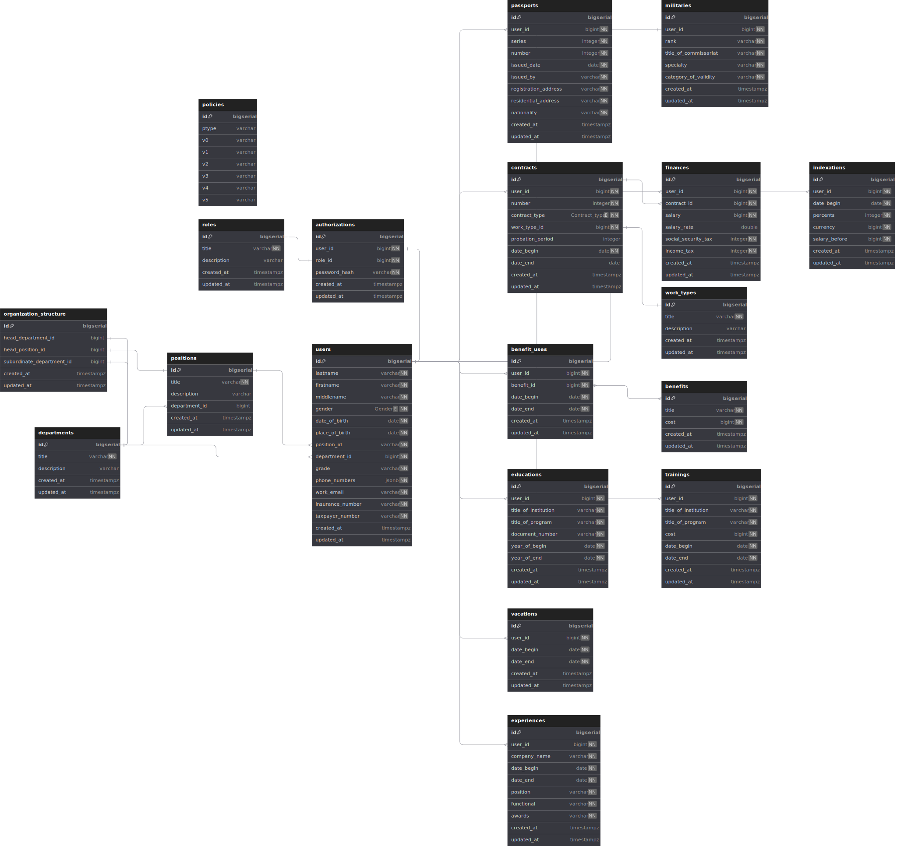

# Описание серверной части (backend) проекта "Картотека сотрудника"

- [Общая информация](#общая-информация)
- [Общий взгляд на продукт](#общий-взгляд-на-продукт)
- [Классы и характеристики пользователей](#классы-и-характеристики-пользователей)
- [Техническое задание](#техническое-задание)
    - [Функциональные требования](#)
    - [Диаграмма компонентов](#диаграмма-компонентов)
    - [Схема базы данных](#схема-базы-данных)
- [Особенности реализации](#особенности-реализации)
    - [Сборка](#сборка)
    - [Конфигурация](#конфигурация)
    - [Стек](#стек)
    - [Используемые библиотеки](#используемые-библиотеки)
- [Дальнейшее развитие](#дальнейшее-развитие)

## Общая информация

[Политика ветвления](docs/branching_policy.adoc)

[Внутри командное code review](docs/code_review.adoc)

[Пользовательские истории](docs/user_stories.adoc)

## Общий взгляд на продукт

Картотека сотрудников — это новая система, создаваемая с целью помочь управлять персональными данными сотрудников: опыт работы, образование, хобби и другие. Она должна помочь повысить эффективность работы HR-отдела, структурировать и оптимизировать процессы управления и подбора персонала, сделать работу HR-отдела более эффективной и удобной.

Система включает в себя функции:
1.	Хранение и управление персональными данными сотрудников.
2.	Автоматизация рутинных задач управлением персонала (выявление неактуальных данных сотрудников, рассылка уведомлений сотрудникам, проверка вводимых данных на конфликт с существующими, напоминание о необходимости прохождения сотрудником инструктажа).
3.	Безопасность и конфиденциальность данных (аутентификация пользователей, разграничение прав на совершение просмотра/редактирования/добавления данных, шифрование данных в хранилище).
4.	Автоматизация процесса подбора (возможность доступа в систему для рекрутеров с целью добавления анкет возможных новых сотрудников, преобразование анкеты кандидата в карточку сотрудника) и управления/развития персонала (учёт данных по полученному и получаемому образованию сотрудников, предоставление льгот, учёт профессиональных компетенций).

## Классы и характеристики пользователей

| Класс пользователей | Описание                                                                                                                                                                                                                                                                                                       |
|---------------------|----------------------------------------------------------------------------------------------------------------------------------------------------------------------------------------------------------------------------------------------------------------------------------------------------------------|
| Кандидат            | Претендент на вакантную должность в компании.<br/>Не имеет прямого доступа в систему, взаимодействует через рекрутера. Заполняет резюме и отправляет его рекрутеру, при необходимости соглашается с обработкой персональных данных.                                                                            |
| Сотрудник           | Работник (бывший или настоящий) компании, персональные данные которого хранятся и обрабатываются в системе.                                                                                                                                                                                                    |
| HR                  | 1. Лицо, с которым у компании имеются договорные отношения с целью кадрового учета и управления персоналом<br/>2. Работник компании, занимающийся кадровым учетом и управлением персоналом<br/>Имеет права доступа на просмотр (минимально) и/или добавление и/или редактирование данных сотрудников компании. |
| Рекрутер            | 1. Лицо, с которым у компании имеются договорные отношения с целью поиска (рекрутинга) новых кадров<br/>2. Действующий HR компании.<br/>Имеет право на создание анкет потенциальных сотрудников в системе.                                                                                                     |
| Администратор       | Сотрудник компании, имеющий право на создание учетных записей HR/рекрутеров, генерацию и выдачу паролей для новых HR/рекрутеров, изменение прав доступа для HR/рекрутеров.<br/>Не имеет доступа к полным персональным данным сотрудников (см. словарь данных: сотрудник).                                      |

## Техническое задание
### [Функциональные требования](docs/requirements.adoc)

### Диаграмма компонентов


### Схема базы данных



## Особенности реализации
### Сборка
Для сборки приложения можно использовать команду (прописана в `Makefile`):
```make
make ...
```
Либо аналоги (выполняются из корня проекта):
```bash
GOARCH=amd64 GOOS=linux go build -o ${BINARY_NAME}-linux ./cmd/main.go
GOARCH=amd64 GOOS=windows go build -o ${BINARY_NAME}-windows ./cmd/main.go
GOARCH=amd64 GOOS=darwin go build -o ${BINARY_NAME}-darwin ./cmd/main.go
```


### Конфигурация
Приложение конфигурируется переменными окружения.

Если параметр не задан, то при запуске будет выдана ошибка и приложение завершится с кодом `1`.

| Переменная окружения    | Описание                                 |
|-------------------------|------------------------------------------|
| `PG_URL`                | Адрес подключения к базе данных          |
| `PG_POOL_MAX`           | Максимальное количество подключений к БД |
| `PG_CONN_ATTEMPTS`      | Количество попыток подключения к БД      |

### Стек
- Основной язык: Go
- Маршрутизатор/веб-фреймворк: 
- База данных: PostgreSQL
- Docker, Docker Compose

### Используемые библиотеки
- Конфигурация: 
- Работа с БД:
- Тестирование:

## Дальнейшее развитие

- [ ] 
